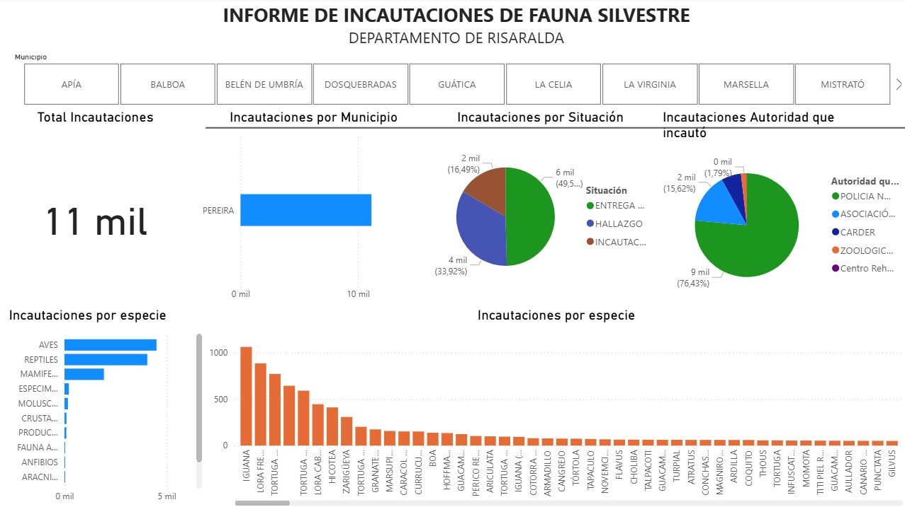

# Análisis de Incautaciones de Fauna Silvestre - Departamento de Risaralda


## Descripción del Proyecto
Este proyecto analiza los datos históricos de incautaciones, hallazgos y entregas voluntarias de fauna silvestre en el departamento de **Risaralda, Colombia**. A través del flujo de trabajo de Inteligencia de Negocios y Minería de Datos, se transformaron datos crudos para construir un **Dashboard interactivo en Power BI** enfocado en proporcionar herramientas visuales clave para la toma de decisiones, la protección ambiental y la formulación de políticas públicas de biodiversidad.

---

## Metodología Aplicada: Proceso KDD (Knowledge Discovery in Databases)

El desarrollo del proyecto siguió las etapas fundamentales del proceso KDD:

1. **Selección de Datos:** Carga y lectura del conjunto de datos fuente en formato `.csv` codificado en `UTF-8`.
2. **Preprocesamiento (Limpieza):** Eliminación de columnas irrelevantes, remoción de espacios blancos al inicio/final de campos de texto, eliminación de inconsistencias y filtrado focalizado en la jurisdicción del departamento de Risaralda.
3. **Transformación:** Estandarización de nombres de variables, homologación de registros mediante reemplazo de valores y asignación de categorías de datos geográficas (`Ciudad` y `Estado o provincia`).
4. **Minería de Datos / Análisis Exploratorio:** Construcción de modelos interactivos, segmentadores contextuales y agregaciones para descubrir patrones, picos geográficos y distribución por grupos taxonómicos.
5. **Interpretación y Evaluación:** Diseño e integración del dashboard interactivo para el análisis visual y extracción de conocimiento para entes de control ambiental.

---

## Paso a Paso del Flujo ETL (Power Query & Power BI)

### 1. Extracción e Importación
* **Fuente:** Archivo delimitado por texto/CSV.
* **Configuración:** Ajuste de codificación de origen a `UTF-8` y cambio de delimitador de coma (`,`) a punto y coma (`;`).

### 2. Limpieza y Normalización
* **Depuración de columnas:** Depuración de columnas sin cabecera o sin representatividad estadística.
* **Renombrado de atributos:** Normalización de nombres de columnas como `año` y `nom tipo especie`.
* **Sanitización de texto:** Aplicación de la función `Recortar` (*Trim*) en todas las columnas de texto para eliminar espacios sobrantes al inicio y final.
* **Estandarización:** Uso de `Reemplazar valores` para homologar nombres de municipios y especies con variaciones tipográficas.

### 3. Filtrado y Categorización Geográfica
* **Filtro regional:** Selección exclusiva de registros correspondientes al departamento de **Risaralda** y eliminación de valores nulos o vacíos en la columna `Municipio`.
* **Categorización semántica:**
  * `Municipio` ➔ Categorizado como **Ciudad**.
  * `Departamento` ➔ Categorizado como **Estado o provincia**.

---

## Dashboard Interactivo

El informe visual consta de un panel interactivo diseñado para permitir el filtrado multinivel por municipios, especies y autoridades.



### Componentes Visuales del Informe:
* **Segmentadores de Datos:** Menú superior por `Municipio` para análisis focalizado por zona.
* **KPIs Principal:** Tarjeta de indicación con el **Total de Incautaciones** (Registradas en el periodo).
* **Distribución Geográfica:** Gráfica de barras horizontales mostrando las *Incautaciones por Municipio*.
* **Mecanismos de Ingreso:** Gráfico circular detallando la *Cantidad por Situación* (Entrega voluntaria, hallazgo, incautación).
* **Entidades de Control:** Gráfico circular por *Autoridad que incautó* (CARDER, Policía Nacional, etc.).
* **Impacto Taxonómico:** Gráfico de barras por clase (`Aves`, `Reptiles`, `Mamíferos`) y desglose detallado a nivel de especie.

---

## Hallazgos

* **Foco Geográfico:** **Pereira** concentra la gran mayoría de los casos (superando las 11,000 incautaciones, representando más del **70%** del total regional), seguido por Dosquebradas y Santa Rosa de Cabal. Esto refleja una fuerte correlación entre la urbanización y el tráfico/tenencia ilegal de fauna.
* **Conciencia Ciudadana vs. Tráfico Ilegal:** Cerca del **47.9%** de los casos corresponden a **entregas voluntarias**, evidenciando respuestas positivas en sensibilización ciudadana. Sin embargo, los hallazgos (**33.4%**) y las incautaciones directas (**18.6%**) señalan la persistencia de la comercialización ilícita.
* **Carga Institucional:** La **CARDER** actúa como el pilar fundamental en la región, cubriendo aproximadamente el **78.9%** de los procedimientos de recuperación y recepción de fauna silvestre.
* **Especies Más Vulnerables:**
  * **Aves** (6,698 casos) y **Reptiles** (5,128 casos) son los grupos taxonómicos con mayor presión de extracción.
  * Especies de alta demanda como la **Lora Frente Amarilla** (*Amazonia ochrocephala*), la **Iguana** (*Iguana iguana*) y diversas especies de **Tortugas** (ej. *Hicotea*) representan los mayores volúmenes de incautación.

---

## Estructura del Repositorio (.PBIP)

Este repositorio utiliza el formato **Power BI Project (`.pbip`)**, optimizado para el control de versiones con Git:

```text
├── Incautaciones Fauna Silvestre.Report/          # Formato visual, páginas y layout
├── Incautaciones Fauna Silvestre.SemanticModel/   # Modelo de datos, relaciones y medidas
├── .gitignore                                     # Archivo para ignorar configuraciones locales
└── Incautaciones Fauna Silvestre.pbip             # Archivo ejecutable del proyecto

## ¿Cómo ejecutar este proyecto localmente?

1. Clonar este repositorio en tu equipo:
   git clone https://github.com/Enqosp/incautaciones-fauna-silvestre-colombia.git
2. Verificar tener instalado **Power BI Desktop** con soporte para `.pbip`.
3. Abrir el archivo `Incautaciones Fauna Silvestre.pbip` directamente desde la raíz de la carpeta clonada.
